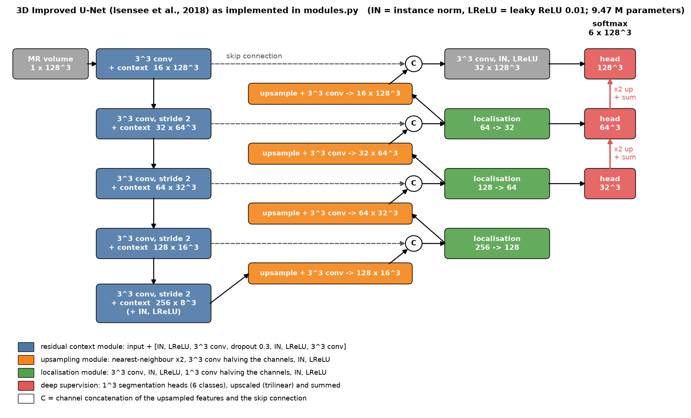
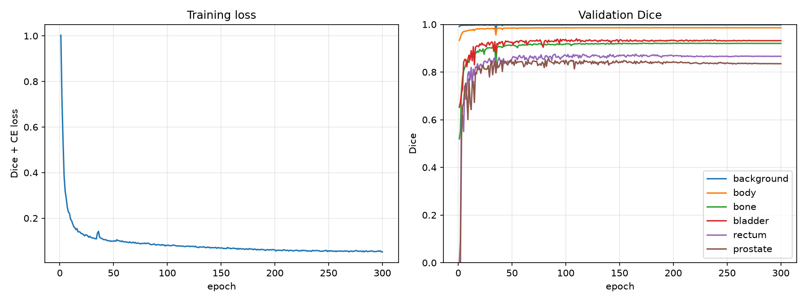
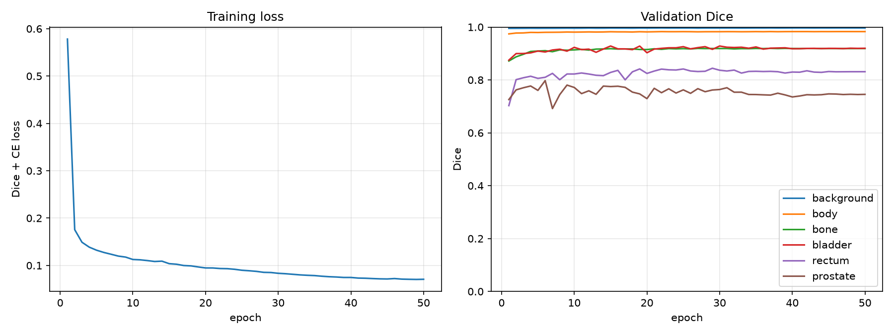
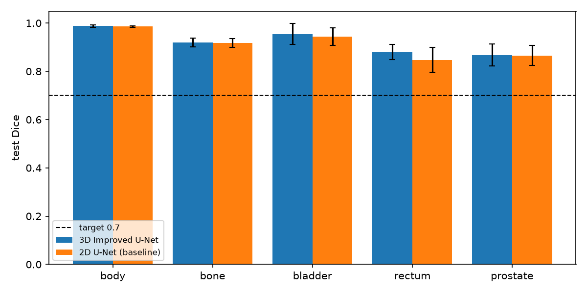
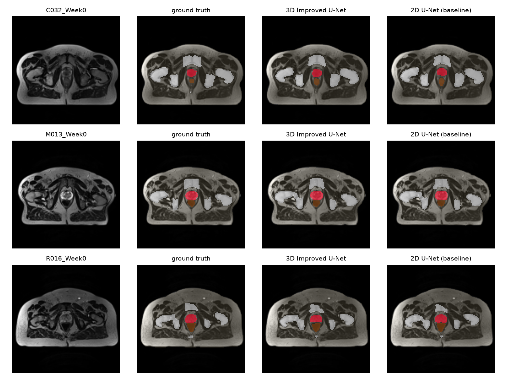
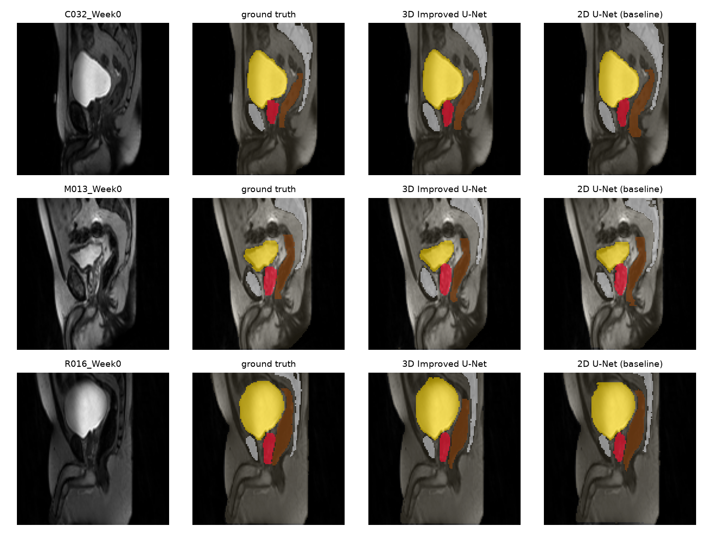
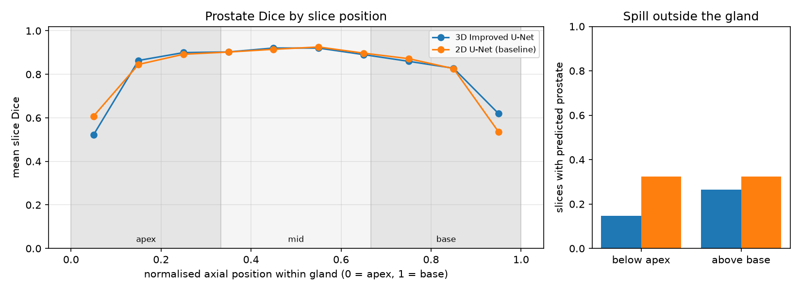
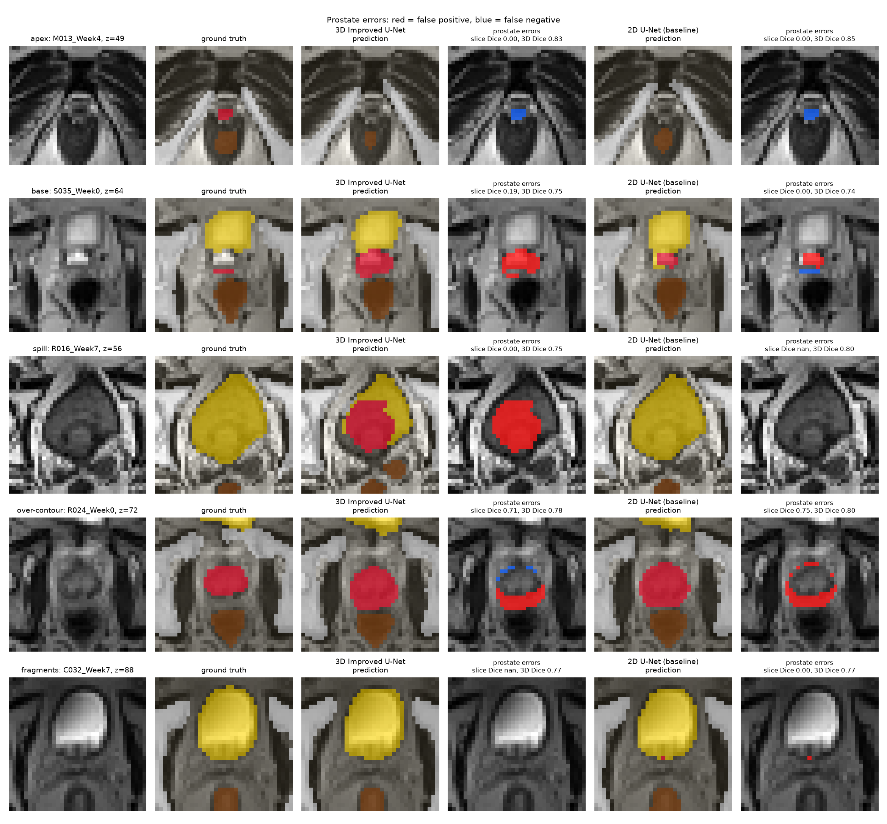
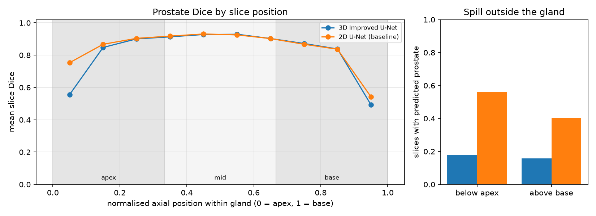

# 3D Improved U-Net for Prostate MRI Segmentation (HipMRI Study)

**Author:** Wenyu Cai (s4984244) · COMP3710 Pattern Recognition, 2026 · Difficulty: Hard

> Status, 8 Oct 2026: all experiments are complete; the AI usage disclosure (marked ⏳) is
> still to be completed by the author.

## Problem and Algorithm

**The problem.** External-beam radiotherapy for prostate cancer needs the prostate and the
organs at risk around it delineated on every planning scan, so the dose can cover the gland while
sparing the bladder and rectum. Drawing these contours by hand is slow, and the HipMRI Study
re-scanned most patients every week of treatment. This project segments pelvic MR volumes into
six classes — background, body, bone, bladder, rectum and prostate — so that a planner only has
to review and correct a draft. It is hard for three reasons: the prostate occupies just 0.10 % of
the voxels; its soft-tissue contrast with the bladder neck (base) and pelvic floor (apex) is
weak; and it sits a few millimetres from the rectal wall, where over-contouring causes toxicity.

**How the model works.** The 3D Improved U-Net (Isensee et al. [1]) is an encoder–decoder
that labels every voxel of the whole 128 × 128 × 128 volume at once (figure below). The encoder
halves the resolution four times with stride-2 3 × 3 × 3 convolutions; each level adds a
residual *context module* (two convolutions with dropout, added back to the input), so deep
levels see the whole pelvis while training stays stable. The decoder upsamples step by step,
concatenates the encoder features of the same resolution through skip connections to recover
precise boundaries, and merges them in *localisation modules*. Segmentation maps taken from
three decoder levels are upscaled and summed (*deep supervision*), which injects coarse,
context-rich predictions into the final output. Instance normalisation [4] is used because the
batch holds only two volumes, and the loss is cross-entropy plus soft Dice over the foreground
classes [3], which keeps the tiny prostate and rectum from being swamped by the background.
Because every 3 × 3 × 3 kernel also sees the slices above and below, the model can use
through-plane continuity that a slice-by-slice 2D U-Net [2] — the baseline here — cannot. Whether
that context actually fixes the clinically dangerous apex and base slices is the question this
project investigates.



## Feasibility Review

*One-page review for the midpoint check-off, updated 6 Oct 2026 with the first full training
runs.*

**1. User need, scope and acceptance criteria.** The user is a radiotherapy planner who
wants draft contours of the prostate and nearby organs at risk (bladder, rectum) plus body
and bone on pelvic MR, to review and correct rather than draw from scratch. The prototype must
show *where* a 3D model is safe to trust, not only its average Dice. It is accepted if:

| # | Criterion (held-out test set: 6 patients, 34 scans) |
|---|---|
| A1 | 3D Improved U-Net reaches Dice ≥ 0.70 on **each** of the 5 foreground classes. |
| A2 | Dilemma: on identical voxels, 3D context counts as a real gain only if prostate Dice in the apex and base thirds of the gland improves on the 2D U-Net by ≥ 0.05, or prostate HD95 drops (paired Wilcoxon over patients). |
| A3 | Prostate leaking into rectum and bladder (mL) and onto slices beyond the true apex/base is reported for both models; the recommendation does not rest on global Dice. |
| A4 | 3D training fits in ≤ 16 GB VRAM and ≤ 3 h on one A100; inference ≤ 1 s per volume; the 3D/2D cost ratio is reported. |
| A5 | No patient appears in two subsets; the split (`splits.json`) and seed are committed. |

**2. Model choice and course concepts.** 3D Improved U-Net (Isensee et al., 2018; Hard):
an encoder–decoder with skip connections, pre-activation residual context modules (dropout 0.3),
instance norm (batch size is only 2) and three summed deep-supervision heads; 9.47 M
parameters. The baseline is a 2D U-Net (Ronneberger et al., 2015; 7.76 M parameters)
trained on axial slices of the *same* volumes and restacked for evaluation, so the only
difference is whether the convolutions see neighbouring slices. Loss is cross-entropy +
foreground soft Dice for the severe class imbalance. Course concepts used: receptive fields
of 2D vs 3D convolutions, skip connections, residual learning, normalisation, loss design for
imbalance, and leakage-free evaluation.

**3. Preliminary evidence.**
*Data audit (Rangpur):* 211 scans from 38 patients (1–8 each); 256×256×128 voxels at
≈1.68×1.68×1.56 mm; prostate is 0.10 % and rectum 0.14 % of voxels; the prostate spans
17–41 axial slices (median 25). Volumes are resampled to 128×128×128, keeping every acquired
slice so the apex/base slices survive. Split stratified by scans per patient: 26/6/6 patients
(143/34/34 scans).
*Smoke tests:* the full pipeline (train → test → evaluation figures) runs end to end on
synthetic NIfTI data and on 3 epochs of real data.
*First full runs (test set, one A100):* the 3D model reaches Dice body 0.99, bone 0.92,
bladder 0.95, rectum 0.88, prostate 0.87, so **A1 is met**; the 2D baseline gets 0.99, 0.92,
0.94, 0.85, 0.87. Cost: 3D 1.1 h training (300 epochs) and 4.0 GB peak VRAM vs 2D 0.23 h and
0.9 GB, i.e. ≈ 5× the compute; inference takes 0.025 s vs 0.022 s per volume (A4 met).
*Early answer to the dilemma:* both models fall from 0.91 Dice in the mid-gland to 0.76–0.78
at the apex and base, and 3D context does not change that (apex −0.02, base +0.02, HD95
−0.1 mm; none significant), so **A2 is not met**. Its one consistent gain is the rectum
(+0.03 Dice, better in all 6 test patients, p = 0.03).

**4. Risks, budget and fallback.**

- *Apex and base stay weak for both models* — the limit may be the 3.4 mm in-plane voxels or
  ambiguous ground truth rather than missing context → next experiment below.
- *Few patients* (26 for training; weekly scans are near-duplicates) → augmentation,
  dropout, model selection on validation patients only.
- *Low statistical power* (6 test patients) → report effect sizes and per-scan tests as well.
- *Shared-cluster queues* → short time limits, cache built on a CPU node, 20-min `a100-test`
  partition for smoke tests.

*Budget:* 1.1 A100-hours per 3D run at 128³ (best epoch ≈ 100 of 300, so runs can be
shortened); at most ≈ 15 GPU-hours in total. *Next experiment:* train both models at the
native 128 × 256 × 256 resolution (an estimated 16 GB for 3D) to test whether resolution, not context,
limits the apex and base; then autopsy the worst apex/base cases. *Fallback:* A1 is already
met at 128³, so the current models are the fallback if the high-resolution runs do not fit
the budget or the queue.

## Dataset and Pre-processing

**Data.** HipMRI Study [7, 8], on Rangpur at `/home/groups/comp3710/HipMRI_Study_open`: pelvic MR
volumes in `semantic_MRs/<patient>_Week<n>_LFOV.nii.gz` with labels in
`semantic_labels_only/<patient>_Week<n>_SEMANTIC.nii.gz`. `python dataset.py` audits it:

| Property | Value |
|---|---|
| Scans / patients | 211 / 38 — 22 patients with 8 weekly scans, 11 with 1, five with 2, 4, 5, 6 and 7 |
| Size (x, y, z) | 256 × 256 × 128 (one scan has 144 slices) |
| Voxel size | 1.41–1.88 mm in-plane (mostly 1.68), 1.56 mm slices; all LPS orientation |
| Labels | 0 background 60.35 %, 1 body 35.46 %, 2 bone 3.37 %, 3 bladder 0.57 %, 4 rectum 0.14 %, 5 prostate 0.10 % of voxels; no out-of-range values; every scan contains prostate |
| Prostate extent | 17–41 axial slices (median 25) |

**Pre-processing** (`dataset.py`), run once and cached as a single tensor file:

1. *Intensity:* each volume is z-score normalised. MR intensities have no physical unit and vary
   with scanner gain, so only relative contrast within a scan is meaningful.
2. *Resampling to 128 × 128 × 128 (D × H × W):* the 128 acquired slices are kept and the in-plane
   grid is halved (voxels ≈ 3.4 mm in-plane, 1.56 mm between slices). With a median of 25 prostate slices, halving the
   slices as well would leave about four slices each for the apex and base — the very slices
   the research question is about. At this size the 3D model trains in 4 GB of GPU memory.
3. *Labels* are resampled by averaging their one-hot encoding over each output voxel and taking
   the arg-max, so a thin structure such as the rectal wall keeps the voxels it dominates;
   nearest-neighbour sampling would drop or keep it depending on where the grid points fall.

**Split.** Patients, not scans, are divided into train / validation / test (70 / 15 / 15 %,
seed 3710). A patient's weekly scans are nearly identical, so a scan-level split would put the
same anatomy in training and test and inflate the scores. Because scan counts per patient range
from 1 to 8, single-scan and multi-scan patients are split separately; a plain random split
gave test sets of 11 to 48 scans depending on the seed. The split is committed as
[`splits.json`](splits.json) so every run and every reviewer uses the same test patients:

| Subset | Patients | Scans |
|---|---|---|
| Train | 26 | 143 |
| Validation | 6 | 34 |
| Test | 6 (C032, M013, R016, R024, S035, T009) | 34 |

**Augmentation** (training only, applied identically to image and label): a left–right flip
(p = 0.5); a rotation of up to ±10° and a scaling by 0.9–1.1, both within the axial plane (p = 0.5); an
intensity gain of 0.9–1.1 and offset of ±0.1; and Gaussian noise with σ = 0.05 (p = 0.2). The
pelvis is roughly left–right symmetric, but anterior–posterior or superior–inferior flips would
put the rectum in front of the prostate or the bladder below it, so they are not used.

**2D baseline data.** The 2D U-Net is trained on the axial slices of the same cached volumes
(not the separate `keras_slices_data` set), and its slice predictions are stacked back into
volumes for evaluation. Both models are therefore scored on exactly the same patients and
voxels.

## Usage

**Files.**

| File | Contents |
|---|---|
| `modules.py` | `ImprovedUNet3D`, the `UNet2D` baseline and `DiceCELoss` (pure PyTorch) |
| `dataset.py` | file pairing, patient split, pre-processing and cache, augmentation, datasets, data audit |
| `utils.py` | model factory, checkpoint loading, whole-volume inference for both models, Dice / IoU |
| `train.py` | training, per-epoch validation, testing of the best checkpoint, loss and Dice curves |
| `predict.py` | evaluation of trained models on the test patients and all figures in this README |
| `slurm/*.sh` | Rangpur batch jobs: `prepare_data.sh` (CPU), `train.sh` and `predict.sh` (one A100) |
| `splits.json` | the committed patient split |

**Dependencies.** Versions used for all reported results (conda environment on Rangpur,
NVIDIA A100-PCIE-40GB):

| Package | Version |
|---|---|
| Python | 3.11.15 |
| PyTorch | 2.13.0 (CUDA 13.0 build) |
| nibabel | 5.4.2 |
| NumPy | 2.4.6 |
| SciPy | 1.17.1 |
| Matplotlib | 3.11.1 |

`pip install torch nibabel scipy matplotlib` is enough. The model code (`modules.py`) uses only
PyTorch; NumPy and SciPy are used in `predict.py` for evaluation and plotting.

**Running on Rangpur.** From this folder (Slurm does not create the log folder itself):

```bash
mkdir -p logs
sbatch slurm/prepare_data.sh                     # audit, splits.json and cache on a CPU node
sbatch -J unet2d slurm/train.sh --model unet2d   # 2D U-Net baseline
sbatch -J unet3d slurm/train.sh --model unet3d   # 3D Improved U-Net
sbatch slurm/predict.sh --checkpoints runs/unet3d/best.pt runs/unet2d/best.pt
```

The scripts forward their arguments to the Python files, which can also be run directly, e.g.
`python train.py --model unet3d --root <HipMRI_Study_open>`. The batch scripts set
`--account=comp3710` (required by the `comp3710` partition) and deliberately request no
`--mem`, which Rangpur's nodes can never satisfy.

| `train.py` option | Default | Meaning |
|---|---|---|
| `--model` | `unet3d` | `unet3d` or `unet2d` |
| `--epochs`, `--batch-size`, `--lr` | 300, 2, 5e-4 (3D); 50, 32, 1e-3 (2D) | optimisation |
| `--shape` | `128x128x128` | volume size D × H × W after resampling (multiples of 16) |
| `--root`, `--cache`, `--out` | Rangpur data path, `cache`, `runs` | input, pre-processed cache, outputs |
| `--weight-decay`, `--seed`, `--workers` | 1e-5, 3710, 4 | |
| `--no-amp` | off | disable mixed precision |
| `--limit N` | – | use only N scans per subset, for smoke tests |

Training uses AdamW [5] with cosine learning-rate decay [6] and mixed precision. After every epoch the
model segments each whole validation volume, and the checkpoint with the highest mean foreground
Dice is kept as `best.pt`. `train.py` writes `best.pt`, `last.pt`, `history.json`, `curves.png`
(loss and per-class validation Dice) and `test_metrics.json` to `runs/<model>/`. `predict.py`
writes the figures and `results.json` to `images/`; with two checkpoints, the first is treated as
the main model.

**Reproducibility.** The split is fixed by `splits.json`, the seed by `--seed`, and the cache
is rebuilt automatically if the shape or the number of scans changes. GPU convolutions and mixed
precision are not bit-for-bit deterministic, so repeated runs differ slightly. A quick check
of the whole pipeline takes a few minutes:
`python train.py --model unet3d --epochs 1 --limit 2`.

## Results

All numbers below are for the held-out test set (6 patients, 34 scans) at 128 × 128 × 128,
using each model's checkpoint with the best validation Dice, on one NVIDIA A100-PCIE-40GB.

**Training.** The 3D model's mean foreground validation Dice peaks at epoch 100 (0.912) and
then drifts down slightly (0.908 at epoch 300) while its training loss keeps falling — mild
over-fitting that selecting the best checkpoint absorbs. The 2D U-Net peaks at epoch 15
(0.886). The baseline was not under-trained: its 50 epochs are 28,600 gradient steps
(572 batches of 32 slices per epoch), more than the 21,300 steps of the 3D model's 300 epochs
(71 batches of 2 volumes).

| 3D Improved U-Net | 2D U-Net baseline |
|---|---|
|  |  |

**Segmentation accuracy** (mean ± standard deviation over scans):

| Class | 3D Dice | 3D IoU | 2D Dice | 2D IoU |
|---|---|---|---|---|
| Body | 0.988 ± 0.005 | 0.976 | 0.985 ± 0.003 | 0.971 |
| Bone | 0.919 ± 0.018 | 0.851 | 0.917 ± 0.018 | 0.847 |
| Bladder | 0.954 ± 0.044 | 0.916 | 0.945 ± 0.036 | 0.897 |
| Rectum | **0.880 ± 0.031** | 0.786 | 0.847 ± 0.051 | 0.738 |
| Prostate | 0.868 ± 0.045 | 0.769 | 0.865 ± 0.041 | 0.764 |

Both models clear the 0.70 target on every class, and the 3D model does so on every single
test scan (its worst scans: prostate 0.747, bladder 0.712), so acceptance criterion A1 is met.
Apart from the rectum (+0.032) the two models are within 0.01 Dice of each other. The
validation patients told a different story — at the selected epochs the 3D model led on
prostate Dice by 0.075 (0.850 vs 0.775) — but on the test patients the lead is 0.003. With
six patients per subset, differences between patients outweigh differences between the
models, which is why the comparisons in the next section are paired and tested per patient.



**Example inputs and outputs** — the first scan of three test patients, axial slice through
the centre of the prostate (anterior up) and sagittal slice (superior up). Colours: bone
white, bladder yellow, rectum brown, prostate red.





Both models are hard to tell apart in the axial view. In the sagittal view, which cuts across
the slices the 2D model segments independently, its rectum outline is slightly more ragged
from slice to slice — the inter-slice inconsistency behind its larger rectum and bladder HD95
in the next section.

**Resources** (mixed precision; batch 2 volumes for 3D, 32 slices for 2D):

| | 3D Improved U-Net | 2D U-Net | 3D / 2D |
|---|---|---|---|
| Parameters | 9.47 M | 7.76 M | 1.2× |
| Training time | 1.12 h (300 epochs) | 0.23 h (50 epochs) | 4.9× |
| Peak training VRAM | 4.04 GB | 0.92 GB | 4.4× |
| Inference latency per volume | 0.028 s | 0.025 s | 1.1× |
| Peak inference VRAM | 0.99 GB | 0.48 GB | 2.1× |

The 3D model costs about five times the training compute and memory, which matches the
"5–10×" premise of the dilemma; at inference both segment a whole volume in a few hundredths
of a second, so deployment cost is not a differentiator.

## Open Research Dilemma: Spatial Context vs. Clinical Boundary Utility

A planner does not care about the average overlap of a contour but about where it is wrong:
at the apex and base, where the prostate meets the pelvic floor and the bladder neck, and at
the thin interface with the rectum. Does the 3D model's through-plane context fix those errors,
or does it only polish the easy mid-gland slices at about five times the training cost?

### Global Dice hides the boundary failures



Each axial slice of each test scan is placed by its relative position in the true gland
(0 = apex, 1 = base) and scored separately. Both models reach 0.91 Dice in the middle third
but only 0.76–0.78 in the apex and base thirds, and 0.52–0.62 on the outermost tenth of the
slices. A global prostate Dice of 0.87 is therefore an average of a near-perfect mid-gland and
end slices where about half of the contour is wrong. The right panel shows how often prostate
is predicted on the slices just beyond the true gland.

### Paired comparison of the two models

Same test scans and voxels; difference = 3D − 2D; two-sided Wilcoxon signed-rank tests over
the 34 scans and over the 6 patient means (the latter is the honest test, since a patient's
weekly scans are correlated; with 6 patients its smallest possible p is 0.031).

| Metric | 3D | 2D | Difference | p (scans) | p (patients) |
|---|---|---|---|---|---|
| Prostate Dice | 0.868 | 0.865 | +0.003 | 0.89 | 0.56 |
| Prostate apex-third Dice | 0.762 | 0.781 | −0.019 | 0.26 | 1.00 |
| Prostate base-third Dice | 0.776 | 0.758 | +0.018 | 0.15 | 0.56 |
| Prostate HD95 (mm) | 4.37 | 4.47 | −0.10 | 0.63 | 0.63 |
| Slices with prostate beyond the gland | 1.24 | 1.94 | −0.71 | 0.008 | 0.44 |
| Prostate over-contoured (mL) | 5.66 | 4.47 | +1.19 | 0.030 | 0.56 |
| Prostate missed (mL) | 3.04 | 3.85 | −0.81 | < 0.001 | 0.094 |
| **Rectum Dice** | **0.880** | **0.847** | **+0.032** | **0.001** | **0.031** |
| Rectum HD95 (mm) | 4.70 | 6.92 | −2.22 | 0.007 | 0.31 |
| Bladder HD95 (mm) | 3.27 | 6.02 | −2.75 | 0.008 | 0.062 |

- **Apex and base: no reliable gain, so criterion A2 is not met.** The 3D model is not better
  at the ends of the gland; on the outermost tenth of the slices it is worse at the apex
  (0.52 vs 0.61) and better at the base (0.62 vs 0.54).
- **Containment: a consistent trend, not a proven effect.** The 3D model predicts prostate on
  15 % of the slices just below the apex (2D: 32 %), splits the gland into separate pieces in
  2 of 34 scans (2D: 5), and its bladder and rectum boundaries are 2–3 mm closer at the 95th
  percentile, because the 2D model leaves stray fragments that a single slice cannot recognise
  as detached. These differences hold across scans but not across the six patients.
- **Bias: the 3D model draws larger glands** — 1.2 mL more over-contoured, 0.8 mL less missed.
  Over-contouring irradiates rectal wall and bladder; under-contouring risks leaving tumour
  untreated, so this is a trade, not an improvement.
- **The rectum is the one effect that holds at the patient level:** +0.032 Dice, better in
  every one of the six test patients.

### Failure autopsy

One case per failure type for the 128³ models, chosen automatically by `predict.py` from a
different test patient each (red = false positive, blue = false negative prostate):



1. **Apex — M013 week 4, slice 49.** The true apex is a 3–4-voxel island in front of the
   rectum; both models miss it completely (apex-third Dice 0.53 vs 0.52). At 3.4 mm in-plane
   voxels the tapering apex is barely resolvable, and the neighbouring slices cannot help
   because the gland is vanishing there too. *Trigger: resolution and partial-volume effect,
   not missing context.*
2. **Base — S035 week 0, slice 64.** This single-scan patient has the smallest gland in the
   test set (17.5 mL). At the base the ground truth is a one-voxel strip under the bladder,
   while both models paint a blob that the image does not separate from the bladder neck;
   the 2D model also splits the gland in two (base-third Dice 3D 0.59, 2D 0.44). *Trigger:
   the bladder-neck boundary is a judgement the annotator made but the intensities do not show.*
3. **Spill into the bladder — R016 week 7, slice 56.** On a slice above the gland the 3D model
   labels a large central region of the bladder as prostate (21.3 mL over-contoured in this scan, base-third
   Dice 0.60), while the 2D model labels it correctly (0.79). The patient's other seven weeks
   are unremarkable (1.8–6.6 mL over-contoured). In week 7 the bladder contents are darker and
   heterogeneous, and the 3D model carries the gland up from the slices below. *Trigger:
   3D context propagating an error — the clearest case where context made the base worse.*
4. **Over-contouring — R024 week 0, slice 72.** In mid-gland both models draw almost the same
   outline, larger than the ground truth and mostly towards the rectum (14.5 and 11.0 mL
   over-contoured). The ground-truth gland in this week is 30.9 mL, 21 % below the median of
   the patient's other seven weeks (39.1 mL), on which both models score 0.86–0.91. Either this
   contour was drawn tighter or the gland swelled during treatment; either way no architecture
   can learn it from the image. *Trigger: variation in the reference contour or the anatomy,
   in the clinically worst direction (rectal wall).*
5. **Fragments — C032 week 7, slice 88.** Above the base the 2D model places a two-voxel
   prostate island on the floor of the bladder, detached from the gland; the 3D model does
   not. This is the error that through-plane context reliably prevents. The same patient
   shows a second, slower problem: the reference gland grows from 19.9 mL in week 0 to 28.2 mL
   in week 7, and both models increasingly under-contour it (9.1 and 9.7 mL missed in week 7).

### Is resolution the bottleneck rather than context?

If the ends of the gland fail because a 3.4 mm in-plane voxel is too coarse for a tapering
structure, more context will not help but more resolution should. Both models were therefore
retrained at the native 128 × 256 × 256 grid (1.68 mm in-plane) with identical settings and
evaluated in the same way (`sbatch slurm/prepare_data.sh --shape 128x256x256`, then
`train.sh ... --shape 128x256x256 --out runs_native`; per-scan results in
[`images/native_results.json`](images/native_results.json), and for 128³ in
[`images/results.json`](images/results.json)).

| Prostate (test set) | 3D 128³ | 3D native | 2D 128³ | 2D native |
|---|---|---|---|---|
| Dice, whole gland | 0.868 | 0.874 | 0.865 | 0.865 |
| Dice, apex third | 0.762 | 0.773 | 0.781 | **0.841** |
| Dice, mid third | 0.914 | 0.922 | 0.910 | 0.921 |
| Dice, base third | 0.776 | 0.741 | 0.758 | 0.762 |
| Slices with prostate beyond the gland | 1.24 | 1.00 | 1.94 | 2.88 |
| Over-contoured / missed (mL) | 5.7 / 3.0 | 4.6 / 3.8 | 4.5 / 3.9 | 6.5 / 3.0 |
| Rectum Dice | 0.880 | 0.894 | 0.847 | 0.875 |
| Lowest single-scan Dice, any class | 0.712 | 0.651 | 0.724 | 0.725 |
| Training time / peak VRAM | 1.1 h / 4.0 GB | 4.4 h / 15.8 GB | 0.23 h / 0.9 GB | 0.82 h / 3.3 GB |



- **The apex responds to resolution, not to context:** doubling the in-plane resolution raises
  the 2D model's apex Dice by 0.060 but the 3D model's by only 0.011, and at native resolution
  the 2D model leads at the apex (0.841 vs 0.773, p = 0.001 over scans, 0.44 over patients).
- **That apex lead is partly an operating point.** At native resolution the 2D model reaches
  0.75 Dice on the outermost tenth of the apex slices (3D: 0.56) but also paints prostate on
  56 % of the slices just below the apex and 40 % just above the base (3D: 18 % and 16 %). The
  2D model keeps drawing slice by slice and so overshoots; the 3D model stops early and so
  undershoots. Neither ends where the gland ends.
- **The base improves with neither.** It is limited by the bladder-neck boundary and the
  variability of the reference contours seen in the autopsy, not by voxel size or context.
- **The native 3D model is less reliable**: it is the only configuration with a test scan
  below 0.70 (bladder 0.651, rectum 0.658) and splits the prostate in 5 of 34 scans (128³: 2),
  while costing four times the training time and needing a 16 GB GPU.
- The rectum gain of 3D holds again (+0.018, better in all six patients, p = 0.031), as does
  its lower spill (1.0 vs 2.9 slices).

### Recommendation to the project manager

1. **Adopt the 3D Improved U-Net at 128³ as the drafting model — for the organs at risk and
   for clean contours, not for the prostate boundary.** At both resolutions it is the better
   rectum model in every test patient, it keeps the prostate in one piece and inside the gland
   more often, and — unlike the native-resolution 3D model — it stays above 0.70 Dice on every
   class of every test scan. Its extra cost is training-only (about 1 GPU-hour on one A100, 4 GB);
   inference takes a few hundredths of a second per scan for either model.
2. **Do not expect 3D context to fix the apex and base, and do not pay for native-resolution
   3D.** Neither context nor a 4× larger grid brings the outer slices of the gland above
   roughly 0.5–0.8 Dice; native-resolution 3D quadruples the cost, needs a 16 GB GPU and is
   less stable.
3. **Keep a human in the loop at the ends of the gland.** Unsuitable for automatic drafting
   without review: the apex and base thirds of the prostate (in particular the first and last
   two or three slices); the bladder neck when the bladder looks unusual (case 3); small glands
   (case 2); and any scan where the prediction has more than one prostate component, which is
   cheap to flag automatically.
4. **Check the reference contours before more model work.** Case 4 shows a single week whose
   reference gland is 21 % smaller than the same patient's other weeks, and patient C032's
   reference grows by 42 % over treatment. Contouring consistency across weeks, or genuine
   swelling, limits every model here; it is worth checking with the clinicians who drew the
   labels.
5. **Treat these results as indicative.** They rest on six test patients; only the rectum
   effect is significant at the patient level. A larger or cross-validated test would be
   needed before clinical use.

## Artificial Intelligence Usage Disclosure

*Draft — the author completes and confirms this section before submission.*

- **Tool:** Anthropic Claude (Claude Code, model Claude Opus 5.5). Commits it contributed to
  carry a `Co-Authored-By` trailer.
- **Tasks it assisted with:** drafting the Python modules and Slurm scripts, the data audit,
  a synthetic-data generator for smoke tests, diagnosing failed Rangpur jobs, the architecture
  figure, and drafting this README.
- **How its output was checked:**
  - the whole pipeline was first run end to end on synthetic NIfTI volumes with known anatomy;
  - the audit of the real data contradicted an assumption about file names (`Case_XXX_WeekY`),
    and the loader was corrected before any training;
  - the patient split was recomputed independently on a second machine and matched exactly;
  - the architecture figure and parameter counts were checked against `modules.py`, and the
    dataset references were checked against their DOIs;
  - ⏳ *[author: own line-by-line review of each file, what was changed as a result, and further
    checks]*.

## Acknowledgements

Data were provided by the HipMRI Study [7], acquired at Calvary Mater Newcastle Hospital in a
retrospective MRI-alone radiation therapy study [8], and used under its data use agreement
(non-commercial; no attempt to identify participants).

## References

1. F. Isensee, P. Kickingereder, W. Wick, M. Bendszus and K. H. Maier-Hein, "Brain tumor
   segmentation and radiomics survival prediction: Contribution to the BRATS 2017 challenge," in
   *Brainlesion: Glioma, Multiple Sclerosis, Stroke and Traumatic Brain Injuries*, 2018,
   pp. 287–297.
2. O. Ronneberger, P. Fischer and T. Brox, "U-Net: Convolutional networks for biomedical image
   segmentation," in *Proc. MICCAI*, 2015, pp. 234–241.
3. F. Milletari, N. Navab and S.-A. Ahmadi, "V-Net: Fully convolutional neural networks for
   volumetric medical image segmentation," in *Proc. 3DV*, 2016, pp. 565–571.
4. D. Ulyanov, A. Vedaldi and V. Lempitsky, "Instance normalization: The missing ingredient for
   fast stylization," arXiv:1607.08022, 2016.
5. I. Loshchilov and F. Hutter, "Decoupled weight decay regularization," in *Proc. ICLR*, 2019.
6. I. Loshchilov and F. Hutter, "SGDR: Stochastic gradient descent with warm restarts," in
   *Proc. ICLR*, 2017.
7. J. Dowling and P. Greer, "Labelled weekly MR images of the male pelvis," v1, CSIRO Data
   Collection, 2021. https://doi.org/10.25919/45t8-p065
8. J. A. Dowling et al., "Automatic substitute computed tomography generation and contouring
   for magnetic resonance imaging (MRI)-alone external beam radiation therapy from standard MRI
   sequences," *Int. J. Radiat. Oncol. Biol. Phys.*, vol. 93, no. 5, pp. 1144–1153, 2015.
   https://doi.org/10.1016/j.ijrobp.2015.08.045
